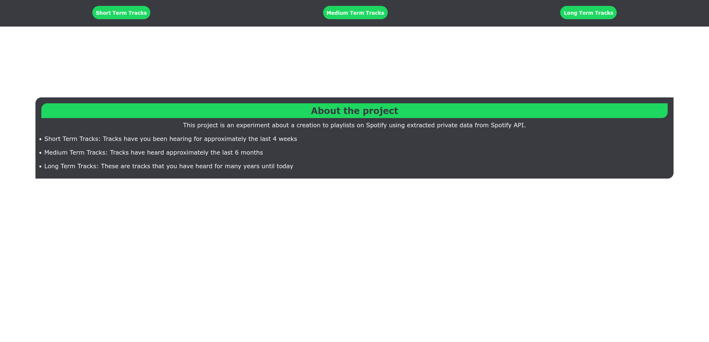
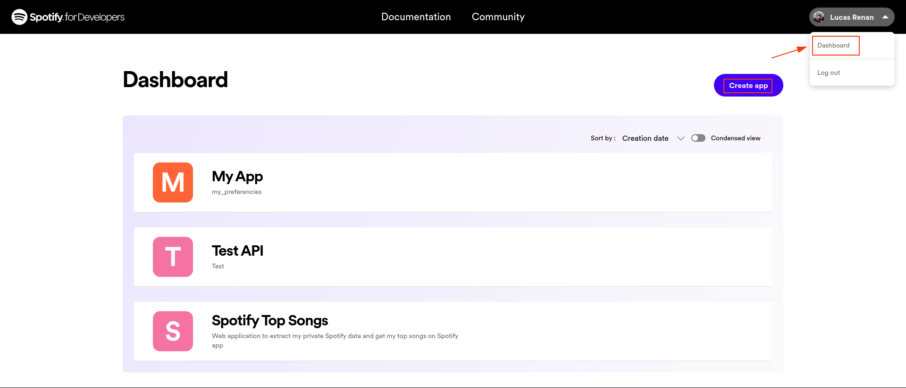
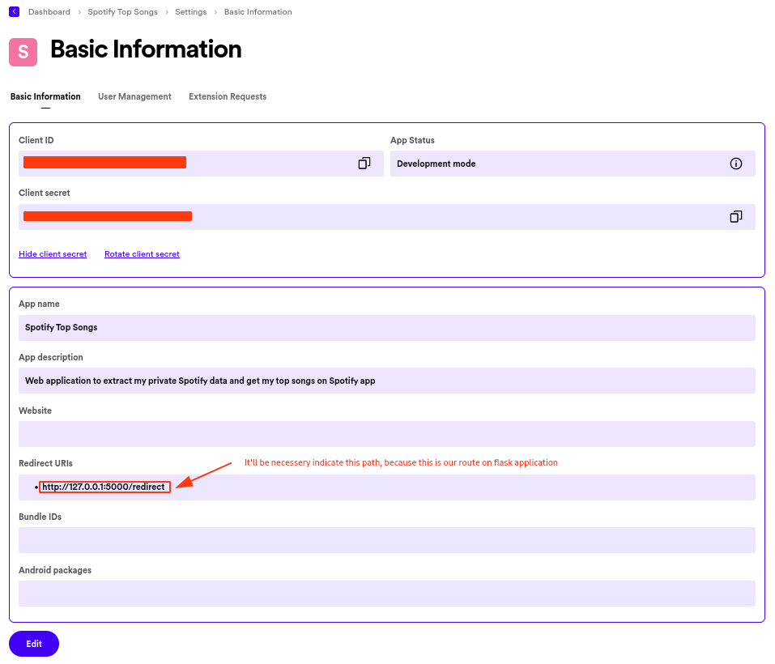
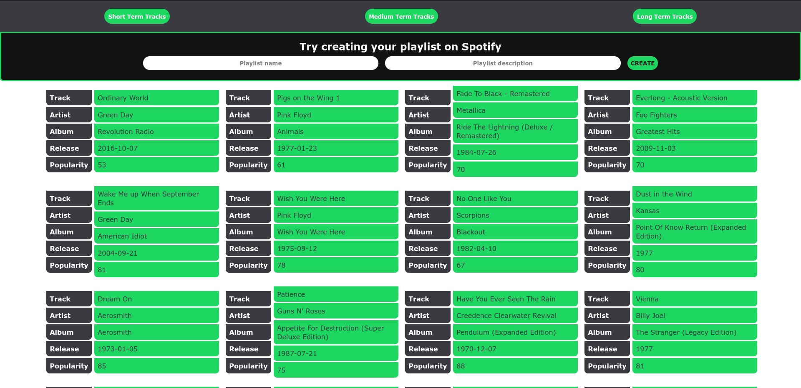

<a name="spotify-top-tracks"></a>

[![Contributors][contributors-shield]][contributors-url]
[![Forks][forks-shield]][forks-url]
[![Stargazers][stars-shield]][stars-url]
[![Issues][issues-shield]][issues-url]
[![MIT License][license-shield]][license-url]
[![LinkedIn][linkedin-shield]][linkedin-url]


<!-- PROJECT LOGO -->
<br />
<div align="center">
  <a href="https://github.com/luk3mn/spotify-top-tracks">
    
  </a>

  <h3 align="center">Spotify Top Tracks</h3>

  <p align="center">
    Web application to extract my private data from Spotify using Spotify API
    <br />
    <a href="https://github.com/luk3mn/spotify-top-tracks/README.md"><strong>Explore the docs »</strong></a>
    <br />
    <br />
  </p>
</div>


<!-- TABLE OF CONTENTS -->
<details>
  <summary>Table of Contents</summary>
  <ol>
    <li>
      <a href="#about-the-project">About The Project</a>
      <ul>
        <li><a href="#built-with">Built With</a></li>
      </ul>
    </li>
    <li>
      <a href="#getting-started">Getting Started</a>
      <ul>
        <li><a href="#prerequisites">Prerequisites</a></li>
        <li><a href="#installation">Installation</a></li>
      </ul>
    </li>
    <li><a href="#usage">Usage</a></li>
    <li><a href="#roadmap">Roadmap</a></li>
    <li><a href="#license">License</a></li>
    <li><a href="#contact">Contact</a></li>
    <li><a href="#acknowledgments">Acknowledgments</a></li>
  </ol>
</details>


<!-- ABOUT THE PROJECT -->
## About The Project



<p align="justify">
  A simple web application to consume my private data from Spotify using the Web API from Spotify for developers and to be able to build a data pipeline ETL using Flask to get authorization to consume these data and extract them from my Spotify account.
</p>


> Authorization

It's the first part of our application because we need to get permission for it to use our private data on Spotify. We can find it on the authorization route from the flask application.
- Authorization: allow Flask application can use private user data

### Modules
> Get Access Token

We can send a type 'post' request with the params necessary to API and get a response with an access token:
- TYPE: "grant_type"
- AUTHORIZATION CODE: "code"
- APP REDIRECT URI: "redirect_uri"
- SPOTIFY CLIENT ID: 'client_id'
- SPOTIFY CLIENT SECRET: 'client_secret'

_NOTE: we can get these params on Spotify documentation_

> Get Data: 

This module can get our data from Spotify API and store it in a JSON file to treat after processing it:
- According to the Spotify API, we can recover three types of our user's top items using a param named 'time_range', there are:
    - long-term (Several years of data and including all new data as it becomes available)
    - medium-term (approximately last 6 months)
    - short-term (approximately last 4 weeks)
- On top of that, we can specify the type of content 'artist' or 'tracks', for us, we need just 'tracks'.

> Structure top items

We can use it to structure every data extracted using pandas, in other words, part of the transformation data happens here because we need to organize these data before loading on the sqlite database.
1. We need to get these data stored in a JSON file
2. To structure these data using dictionaries
3. Return a visualization with some fields using a pandas data frame

> Validation

Before loading all these data on a database, it's important to make some validation, like treating null values or empty data.

> Load data

The last step is to load the processing data in a SQLite database using SQLalchemy and Pandas to convert DataFrame into SQL.

<p align="right">(<a href="#spotify-top-tracks">back to top</a>)</p>


### Built With

Write here

* [![Python][Python]][Python-url]
* [![Flask][Flask]][Flask-url]
* [![Pandas][Pandas]][Pandas-url]
* [![SQLite][SQLite]][SQLite-url]
* [![Spotify][Spotify]][Spotify-url]
* [![Json][Json]][Json-url]

<p align="right">(<a href="#spotify-top-tracks">back to top</a>)</p>


<!-- GETTING STARTED -->
## Getting Started

Here are some important topics about this project and how to replay it.

### Prerequisites

* virtualenv
  ```sh
  python3 -m venv .venv
  ```

### Installation

_Before starting this application in your local environment, it'll be necessary to proceed with some tasks to reproduce this project._

1. Get API Access [https://developer.spotify.com](https://developer.spotify.com/documentation/web-api)
2. Clone the repo
   ```sh
   git clone https://github.com/luk3mn/spotify-top-tracks.git
   ```
3. Install packages
   ```sh
   pip freeze -r requirements.txt
   ```

<p align="right">(<a href="#spotify-top-tracks">back to top</a>)</p>


<!-- USAGE EXAMPLES -->
## Usage

1. Create a new app on Spotify API after logging on your spotify account


2. Get both access credentials, "CLIENT_ID" and "CLIENT_SECRET" and indicate your redirect path of the application


**OBS: This path it'll be necessary to extract our data from Spotify, we can specify it after building our flask application.**

_For more explanations, please refer to the [Documentation](https://developer.spotify.com/documentation/web-api/tutorials/getting-started)_

<p align="right">(<a href="#spotify-top-tracks">back to top</a>)</p>




<!-- ROADMAP -->
## Roadmap

- [x] Pipeline ETL from Spotify Private Data
  - [x] Data Extract -> Get data using Spotify API
  - [x] Data Transform -> Make all data structure using pandas and validation
  - [x] Data Load -> Store these data on SQLite database to recover later on web application
- [x] Web application
  - [x] Front-end -> interface with user
  - [x] Option to create a new playlist -> Use these extracted data to create a new playlist on Spotify account

<p align="right">(<a href="#spotify-top-tracks">back to top</a>)</p>


<!-- LICENSE -->
## License

Distributed under the MIT License. See `LICENSE.txt` for more information.

<p align="right">(<a href="#spotify-top-tracks">back to top</a>)</p>


<!-- CONTACT -->
## Contact

Lucas Renan - lucasnunes2030@gmail.com

Project Link: [https://github.com/luk3mn/spotify-top-tracks](https://github.com/luk3mn/spotify_top_tracks)

<p align="right">(<a href="#spotify-top-tracks">back to top</a>)</p>


<!-- ACKNOWLEDGMENTS -->
## Acknowledgments

I think it would be interesting to sit here some references and other resources that were really useful and helped me to come up with this project.
* [Data Engineering Course for Beginners - #1 EXTRACT](https://www.youtube.com/watch?v=dvviIUKwH7o)
* [Data Engineering Course For Beginners - #2 TRANSFORM](https://www.youtube.com/watch?si=4eZ8d_WhtkNkS12o&v=X-phMpEp6Gs&feature=youtu.be)
* [Data Engineering Course For Beginners - #3 LOAD](https://www.youtube.com/watch?v=rvPtpOjzVTQ)
* [Scrape Spotify’s API within 20 mins](https://alpargur.medium.com/scrape-spotifys-api-in-within-20-mins-611885897851)
* [Spotify OAuth: Automating Discover Weekly Playlist - Full Tutorial](https://www.youtube.com/watch?v=mBycigbJQzA)
* [Bored of Libraries? Here’s How to Connect to the Spotify API Using Pure Python](https://python.plainenglish.io/bored-of-libraries-heres-how-to-connect-to-the-spotify-api-using-pure-python-bd31e9e3d88a)
* [Spotify API OAuth - Automate Getting User Playlists (Complete Tutorial)](https://www.youtube.com/watch?v=olY_2MW4Eik)
* [Python: Loop through JSON File](https://stackoverflow.com/questions/41445573/python-loop-through-json-file)
* [How to Solve: Insufficient client scope in Python using Spotipy](https://stackoverflow.com/questions/56173066/how-to-solve-insufficient-client-scope-in-python-using-spotipy)
* [Best-README-Template](https://github.com/othneildrew/Best-README-Template)
* [Proteja seus Tokens em Python com dotenv](https://www.linkedin.com/pulse/proteja-seus-tokens-em-python-com-dotenv-jheniffer-gonsalves%3FtrackingId=Ojcu6r8HSfyPCJgZMml0pg%253D%253D/?trackingId=Ojcu6r8HSfyPCJgZMml0pg%3D%3D)

<p align="right">(<a href="#spotify-top-tracks">back to top</a>)</p>


<!-- MARKDOWN LINKS & IMAGES -->
<!-- https://www.markdownguide.org/basic-syntax/#reference-style-links -->
[contributors-shield]: https://img.shields.io/github/contributors/luk3mn/spotify-top-tracks.svg?style=for-the-badge
[contributors-url]: https://github.com/luk3mn/spotify-top-tracks/graphs/contributors
[issues-shield]: https://img.shields.io/github/issues/luk3mn/spotify-top-tracks.svg?style=for-the-badge
[issues-url]: https://github.com/luk3mn/spotify-top-tracks/issues
[forks-shield]: https://img.shields.io/github/forks/luk3mn/spotify-top-tracks.svg?style=for-the-badge
[forks-url]: https://github.com/luk3mn/spotify-top-tracks/network/members
[stars-shield]: https://img.shields.io/github/stars/luk3mn/spotify-top-tracks.svg?style=for-the-badge
[stars-url]: https://github.com/luk3mn/spotify-top-tracks/stargazers
[license-shield]: https://img.shields.io/github/license/othneildrew/Best-README-Template.svg?style=for-the-badge
[license-url]: https://github.com/luk3mn/spotify-top-tracks/blob/master/LICENSE
[linkedin-shield]: https://img.shields.io/badge/-LinkedIn-black.svg?style=for-the-badge&logo=linkedin&colorB=555
[linkedin-url]: https://www.linkedin.com/in/lucasmaues/
[general-code-screenshot]: assets/general-project.png

<!-- Stack Shields -->
[Python]: https://img.shields.io/badge/Python-3776AB?style=for-the-badge&logo=python&logoColor=ffffff
[Python-url]: https://www.python.org/
[Flask]: https://img.shields.io/badge/Flask-000000?style=for-the-badge&logo=flask&logoColor=ffffff
[Flask-url]: https://flask.palletsprojects.com/en/3.0.x/
[Pandas]: https://img.shields.io/badge/Pandas-150458?style=for-the-badge&logo=pandas&logoColor=ffffff
[Pandas-url]: https://pandas.pydata.org/
[SQLite]: https://img.shields.io/badge/SQLITE-003B57?style=for-the-badge&logo=sqlite&logoColor=ffffff
[SQLite-url]: https://www.sqlite.org/index.html
[Spotify]: https://img.shields.io/badge/Spotify%20API-1DB954?style=for-the-badge&logo=spotify&logoColor=ffffff
[Spotify-url]: https://developer.spotify.com/documentation/web-api
[Json]: https://img.shields.io/badge/Json-000000?style=for-the-badge&logo=json&logoColor=ffffff
[Json-url]: https://www.json.org/json-en.html